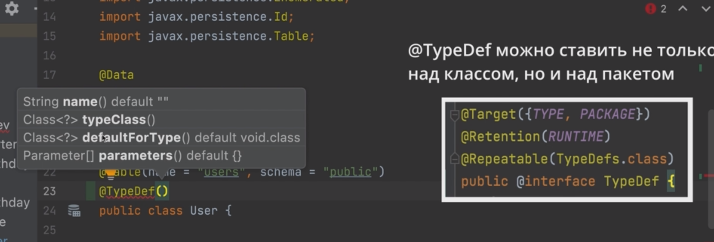

# ORM (Hibernate)

### Теория

[Documentation - 6.0 - Hibernate ORM](https://hibernate.org/orm/documentation/6.0/)

[Hibernate ORM 6.0.0.Final User Guide](https://docs.jboss.org/hibernate/orm/6.0/userguide/html_single/Hibernate_User_Guide.html)


### Notes

### DmDev - Hibernate Starter 2022

### 1. Introducing

- 1.7. TypeConverter - *`@Enumerated*(EnumType.ORDINAL)`
    
    ```java
    /*
    в БД запись будет отображаться на основе String значения,
    а не на основе порядка следования в Enum'е. т.е. @Enumerated(EnumType.ORDINAL)
    */
    
    @Enumerated(EnumType.STRING) 
    private Role role;
    ```
    
- 1.8. Attribute converter
    
    ```java
    /*
    Records определяются с помощью ключевого слова record,
    за которым следует название записи. Дальше идет список полей записи.
    Причем по умолчанию все они будут приватными и иметь модификатор final.
    Также будет создаваться конструктор параметрами.
    А каждого поля автоматически будет создаваться одноименный общедоступный метод
    для получения значения это поля. Например, для поля name создается метод name(),
    который возвращает значение поля name.
    
    И также автоматически будут создаваться методы equals, hashCode и toString.
    Вообщем, данная record будет полностью аналогична вышеопределенному классу,
    но при этом содержит гораздо меньше кода.
    */
    
    //ChronoUnit: https://betacode.net/13745/java-chronounit
    
    public record Bitrhday(LocalDate birthday) {
    	
    	public long getAge() {
    		return ChronoUnit.YEARS.between(birthday, LocalDate.now());
    	}
    }
    ```
    
    Реализация конвертора
    
    ```java
    public class BirthdayConverter implements AttributeConverter<Birthday, Date> {
    	
    	@Override
    	public Date convertToDatabaseColumn(Birthday attribute) {
    		return Optional.ofNullable(attribute)
    				.map(Birthday::birthday)
    				.map(Date::valueOf)
    				.orElse(null);
    	}
    
    	@Override
    	public Birthday convertToEntityAttribute(Date dbData) {
    		return Optional.ofNullable(dbData)
    				.map(Date::toLocalDate)
    				.map(Birthday::new)
    				.orElse(null);
    	}
    }
    
    // кастомный конвертер над полем
    @Convert(converter = BirthdayConverter.class)
    	@Column(name = "birth_date")
    	private Birthday birthDate;
    
    /*
    для того чтобы каждый раз не прописывать
    @Convert(converter = BirthdayConverter.class) над полями
    */
    Configuration configuration = new Configuration();
    		configuration.addAttributeConverter(new BirthdayConverter(), true);
    		configuration.configure(); //path to config file
    ```
    
- 1.9. Custom user type
    
    Для определения нового типа SQL, аналога которого нет в Hibernate, нужно переопределить интерфейс *`@Type || @UserType` -* сложно, лучше использовать библиотеки: hibernate-types
    
    
    
    ```java
    //объявление поля в model-классе  
    @Type(type = "com.vladmihalcea.hibernate.type.json.JsonBinaryType")
    	private String info;
    
    //регистрация новго типа в Configuration
    configuration.registerTypeOverride(new JsonBinaryType());
    configuration.configure(); //path to config file
    ```
    
- 1.10. session: save delete update get
    
    `update | saveOrUpdate`
    
    У hibernate отложенная отправка запросов
    
    если сущности нет при update то - exception
    
    `delete`
    
    удаление по id - обязателен!
    
    `get` - reflection API
    
    session.get(User.*class*, 2);
    
- 1.11 EntityPersister - CRUD
    
    EntityPersister -маппит sql запросы с сущностью(@id) для каждой сущности. ООП в SQL.
    
    
    
- 1.12 First level cache
    
    First level cache - кэш первого уровня (по умолчанию), нельзя отключить. 
    
    Пример 
    
    ```java
    User u1 = session.get(User.class, "Max");
    
    // будет произведен только один запрос, а не два,
    // данные будут получны из кэша
    User u2 = session.get(User.class, "Max");
    ```
    
    PersistenceContext - кэш первого уровня. Сущность помещается в PersistenceContext только после запроса в БД.
    
    PersistenceContext  содержит ссылку на свою сессию
    на каждый Session есть свой PersistenceContext
    
    PersistenceContext содержит в себе `Map<EntityKey, Object>`, который и является кэшем
    
    ```java
    //удаляем сущность PersistenceContext'a - кэш первого уровня
    			session.evict(u2);
    			//очиска кэша
    			session.clear();
    			// при закрытии сессии очищается кэш
    			session.close();
    			session.getTransaction().commit();
    ```
    
    Все действия над сущностями ассоциированными с PersistenceContext (кэш первого уровня) отразятся в БД `(DirtySession)`
    
    ```java
    User u1 = session.get(User.class, "Max");
    			u1.setLastname("NeMaximov");
    			// изменения в базе данных отразятся без session.update(u1);
    			session.getTransaction().commit();
    ```
    
    session.flush() - синхронизирование сущности с БД
    
    session.isDirty() - проверка является ли сессия “грязной”
    
    
    
- 1.13-14 Entity lifecycle
    
    у Entity 4 состояния: Transient, Persist, Detached и Removed
    
    ![Untitled]Files/Untitled%203.png)
    
    `Transient` - объект создан, но не в кэше
    
    `Perisistant` - entity проассоциирован с PersistenceContext **данной сессии**.
    
    `Deleted` - entity удалена из PersistenceContext (кэша) и переходит в состояние removed при закрытии session или session.flush()
    
    `Detached` - при session.clear() | .close() | .evict(entity) - сущность существует, но она не ассоциирована с PersistenceContext (но была проассоциирована), (можем вернуть в Perisistant)
    
- 1.15 JPA - Theory
    
    
    

### 2. Logging

- 2.1. Logging - Theory
    
    
    
    
    
    
    
- 2.2 Log4j
    
    Конфигурация log4j в `resources/log4j.xml`
    
    ```xml
    <?xml version="1.0" encoding="UTF-8" ?>
    <!DOCTYPE log4j:configuration SYSTEM "log4j.dtd">
    
    <log4j:configuration>
    	
    	// ОПТПРАВКА СООБЩЕНИЯ
       <appender name="console" class="org.apache.log4j.ConsoleAppender">
          <param name="target" value="System.out"/>
    
    	// ФОРМАТ СООБЩЕНИЯ
          <layout class="org.apache.log4j.PatternLayout">
             <param name="conversionPattern" value="[%d{HH:mm:ss,SSS}] %p [%c: %L] %m%n"/>
          </layout>
       </appender>
    
       <root>
    //warn level
          <level value="trace"/>
    //Куда отправляем сообщения
          <appender-ref ref="console"/>
       </root>
    
    </log4j:configuration>
    ```
    
    [PatternLayout (Apache Log4j 1.2.17 API)](https://logging.apache.org/log4j/1.2/apidocs/org/apache/log4j/PatternLayout.html)
    
    Нужно создавать логгер для каждого класса
    
    ```java
    public class HibernateRunner {
    	
    	public static final Logger log = LoggerFactory.getLogger(HibernateRunner.class);
    
    	public static void main(String[] args) throws SQLException {
    ```
    
- 2.3 File Appender
    
    Add file appender
    
    ```xml
    <?xml version="1.0" encoding="UTF-8" ?>
    <!DOCTYPE log4j:configuration SYSTEM "log4j.dtd">
    
    <log4j:configuration>
    
    	<appender name="console" class="org.apache.log4j.ConsoleAppender">
    		<param name="target" value="System.out"/>
    
    		<layout class="org.apache.log4j.PatternLayout">
    			<param name="conversionPattern" value="[%d{HH:mm:ss,SSS}] %p [%c: %L] %m%n"/>
    		</layout>
    	</appender>
    
    	<appender name="file" class="org.apache.log4j.RollingFileAppender">
    		<param name="file" value="hibernate-starter.log"/>
    
    		<param name="append" value="true"/>
    		<param name="maxFileSize" value="20MB"/> //макс размерф файла
    		<param name="maxBackupIndex" value="10"/> //макс кол-во файлов (Rolling)
    
    		<layout class="org.apache.log4j.PatternLayout">
    			<param name="conversionPattern" value="[%d{yyyy-MM-dd HH:mm:ss,SSS}] %p [%c: %L] %m%n"/>
    		</layout>
    
    		<filter class="org.apache.log4j.varia.LevelRangeFilter">
    			<param name="LevelMin" value="ALL"/>
    		</filter>
    	</appender>
    
    //иерархия логгеров
    <logger name="com.nchudinov">
    		<level value="info"/>
    		<appender-ref ref="console"/>
    	</logger>
    
    	<root>
    		<level value="trace"/>
    		<appender-ref ref="console"/>
    		<appender-ref ref="file"/> //добавляем еще один аппендер
    	</root>
    
    </log4j:configuration>
    ```
    
    @Sl4j  (Lombok) над классом генерирует константу *`public static final* Logger log = LoggerFactory.getLogger(HibernateRunner.*class*);`
    

### 3. Embedded comps + Primary keys

- 3.1. Embedded components (Сложные объекты)
    
    Объединение нескольких полей в единую сущность (пример: personal info)
    
    Вложенные объекты на уровне Java → Отдельная таблица в таблице
    
    БЫЛО:
    
    ```java
    @Data //generate equals + hashCode etc.
    @NoArgsConstructor
    @AllArgsConstructor
    @Builder
    @Entity
    @Table(name = "users", schema = "public")
    public class User {
    	
    	@Id
    	private String username;
    	private String firstname;
    	private String lastname;
    	
    	@Convert(converter = BirthdayConverter.class)
    	@Column(name = "birth_date")
    	private Birthday birthDate;
    	
    	@Enumerated(EnumType.STRING)
    	private Role role;
    	
    }
    ```
    
    СТАЛО:
    
    ```java
    @Data//generate equals + hashCode etc.
    @NoArgsConstructor
    @AllArgsConstructor
    @Builder
    @Entity
    @Table(name = "users", schema = "public")
    public classUser {
    
    @Id
    privateString username;
    
    @Embedded
    privatePersonalInfo personalInfo;
    
    @Enumerated(EnumType.STRING)
    privateRole role;
    
    }
    ```
    
    +
    
    ```java
    @Data
    @NoArgsConstructor
    @AllArgsConstructor
    @Builder
    @Embeddable
    public class PersonalInfo {
    	private String firstname;
    	private String lastname;
    
    	@Convert(converter = BirthdayConverter.class)
    	@Column(name = "birth_date")
    	private Birthday birthDate;
    
    }
    ```
    
    реализуется с помощью `Embedded component type`
    
    Двухфазовая инициализация - методы hydrate (таблица → объект) + метод resolve(объект → таблица)
    
    Показываем как конкретно нужно маппить
    
    ```java
    @Data//generate equals + hashCode etc.
    @NoArgsConstructor
    @AllArgsConstructor
    @Builder
    @Entity
    @Table(name = "users", schema = "public")
    public classUser {
    
    @Id
    privateString username;
    
    @Embedded
    //конкретно указываем соответствие поля и embedded object и в таблице
    @AttributeOverride(name = "birthDate",column =@Column(name = "birth_date"))
    privatePersonalInfo personalInfo;
    
    @Enumerated(EnumType.STRING)
    privateRole role;
    
    }
    ```
    
- 3.2. Primary keys
    
    ```sql
    create tableusers
    (
        id int  primary key,
        username varchar(128)unique,
        firstname varchar(128),
        lastname varchar(128),
        birth_date date,
    		role varchar(32)
    );
    
    DROP table users;
    ```
    
    Определяем как будет генериться id
    
    ```java
    @Id
    //- автоматический выбирает один из нижних на основе диалекта и т.д.
    	@GeneratedValue(strategy = GenerationType.AUTO)
    // генерация id ложится на БД
      @GeneratedValue(strategy = GenerationType.IDENTITY) - производительный и частый
     // аналог счетчика (каждый раз инкрементится) (не для всех бд)
    @GeneratedValue(strategy = GenerationType.SEQUENCE)
      @GeneratedValue(strategy = GenerationType.TABLE)
    	private Long id;
    	
    	@Column(unique = true)
    	private String username;
    ```
    
    Можно создавать свои SEQUENCE
    
    ```sql
    create sequence user_id_seq owned by user.id;
    ```
    
    ```sql
    create table users
    (
        id bigint primary key,
        username   varchar(128) unique,
        firstname  varchar(128),
        lastname   varchar(128),
        birth_date date,
        role varchar(32)
    );
    ```
    
    ```java
    public class User {
    	
    	@Id
    	@GeneratedValue(strategy = GenerationType.SEQUENCE, generator = "user_gen")
    	@SequenceGenerator(name = "user_gen", sequenceName = "users_id_seq", allocationSize = 1)
    	// hibernate_sequence in hibernate by default
    	private Long id;
    ```
    
    @GeneratedValue(strategy = GenerationType.TABLE)
    
    ```java
    @Table(name = "users", schema = "public")
    public classUser {
    
    @Id
       @GeneratedValue(strategy = GenerationType.TABLE, generator = "user_gen")
    //@SequenceGenerator(name = "user_gen", sequenceName = "users_id_seq", allocationSize = 1)
       // hibernate_sequence in hibernate by default
    @TableGenerator(name = "user_gen",
             table = "all_sequence",
             allocationSize = 1,
             pkColumnName = "table_name",
             valueColumnName = "pk_value"
       )
    privateLong id;
    ```
    
    ```java
    drop table if exists users;
    
    create table users
    (
        id bigint primary key,
        username   varchar(128) unique,
        firstname  varchar(128),
        lastname   varchar(128),
        birth_date date,
        role varchar(32)
    );
    
    create sequence user_id_seq owned by users.id;
    
    drop sequence user_id_seq;
    
    DROP table users;
    
    create table all_sequence
    (
        table_name varchar(32) primary key, 
        pk_value bigint not null
    );
    ```
    
- 3.3. EmbeddedId (Составные первичные ключи из встроенной сущности)
    
    Обычно составные первичные ключи используются в легаси БД
    
    Создание БД
    
    ```sql
    DROP table  if exists users;
    
    create table users
    (
        firstname  varchar(128) not null,
        lastname   varchar(128) not null,
        birth_date date not null,
        username   varchar(128) unique ,
        role varchar(32),
        primary key (firstname, lastname, birth_date)
    );
    ```
    
    Embedded сущность
    
    ```java
    @Data
    @NoArgsConstructor
    @AllArgsConstructor
    @Builder
    @Embeddable
    public class PersonalInfo implements Serializable {
    	@Serial
    	private static final long serialVersionUID = 1L;
    	
    	private String firstname;
    	private String lastname;
    
    	@Convert(converter = BirthdayConverter.class)
    	private Birthday birthDate; 
    
    }
    ```
    
    Тест
    
    ```java
    try(Session session2 = sessionFactory.openSession()) {
    				PersonalInfo key = PersonalInfo.builder()
    						.firstname("Oleg")
    						.lastname("Olegov")
    						.birthDate(new Birthday(LocalDate.of(2000, 01, 01)))
    						.build();
    
    				User user1 = session2.get(User.class, key);
    
    				System.out.println();
    			}
    ```
    
    Будет произведен следующий запрос
    
    ```sql
    select
            user0_.birth_date as birth_da1_0_0_,
            user0_.firstname as firstnam2_0_0_,
            user0_.lastname as lastname3_0_0_,
            user0_.role as role4_0_0_,
            user0_.username as username5_0_0_ 
        from
            public.users user0_ 
        where
            user0_.birth_date=? 
            and user0_.firstname=? 
            and user0_.lastname=?
    ```
    
- 3.4. Other hibernate annotations: @Access, @Transient
    
     `@Access` 
    
    ```java
    // hibernate использует ReflectionAPI для получения доступа к полям сущностей (по-умолчанию)
    @Access(AccessType.FIELD)
    // hibernate использует get'еры и set'кры, отслеживаются аннотации над этими методами, а не над полями (тоже рефлекшн, но через гет + сет)
    @Access(AccessType.PROPERTY)
    ```
    
    `@Transient` - над полем обозначает, что данное поле не должно взаимодействовать с БД(грубо говоря crud)
    
    ```java
    	@Transient
    	@Enumerated(EnumType.STRING)
    	private Role role;
    ```
    
    `@Temporal` - используется для полей типа Date, явно указываем в какой тип поля в БД конвертировать(маппинг) наше поле Date 
    
    ```java
    	@Temporal(TemporalType.TIMESTAMP)
    	@Temporal(TemporalType.DATE)
    	@Temporal(TemporalType.TIME)
    	private Date date;
    ```
    
    Сейчас не используется, так как с java 8 появился новый DateTimeApi `(предпочтительно)`
    
    ```java
    	private LocalDate localDate;
    	private LocalDateTime localDateTime;
    	private LocalTime localTime;
    ```
    
    `@ColumnTransformer` -ставится над полем, позволяет трансформировать колонку перед получением значения или перед записью значения.
    
    `@Formula` тоже что и `@ColumnTransformer`, но без чтения
    

### 4. Mapping entity associations

- 4.1. Many to One
    
    Cоздадим таблицы `users` и `company` со связью `many-to-one`
    
    ```sql
    DROP table  if exists users;
    
    create table company
    (
        id serial primary key,
        name varchar(64) not null unique
    );
    
    create table users
    (
        id bigserial primary key,
        username   varchar(128) unique ,
        firstname  varchar(128),
        lastname   varchar(128),
        birth_date date,
        role varchar(32),
        company_id int references company(id)
    );
    ```
    
    Определение маппинга на уровне java-классов (pojo)
    Однонаправленная связь:
     — User знает про company, а company про user нет
    
    ```java
    //POJO
    @Data
    @NoArgsConstructor
    @AllArgsConstructor
    @Builder
    @Entity
    @Table(name = "company", schema = "public")
    public class Company {
    	
    	@Id
    	@GeneratedValue(strategy = GenerationType.IDENTITY)
    	private Integer id;
    	
    	@Column(name = "name")
    	private String name;
    	
    }
    ```
    
    Если не указывать `@JoinColumn`  по умолчанию будет маппиться как 
    @JoinColumn(name = "company_id"), т.е. name =  название `таблицы_идентификатор` указанный в POJO классе сущности
    
    ```java
    @Data //generate equals + hashCode etc.
    @NoArgsConstructor
    @AllArgsConstructor
    @Builder
    @Entity
    @Table(name = "users", schema = "public")
    public class User {
    	
    	@Id
    	@GeneratedValue(strategy = GenerationType.IDENTITY)
    	private Long id;
    	
    	@Embedded
    	@AttributeOverrides({
    			@AttributeOverride(name = "birthDate", column = @Column(name = "birth_date"))
    	})
    	private PersonalInfo personalInfo;
    	
    	@Column(unique = true)
    	private String username;
    	
    	@Enumerated(EnumType.STRING)
    	private Role role;
    	
    	@ManyToOne
    	@JoinColumn(name = "company_id", referencedColumnName = "id") //не обязательно, но желательно
    	private Company company;
    	
    }
    ```
    
    1) Регистрируем новую сущность в конфиге `Configuration configuration = *new* Configuration();` || hibernate.cfg.xml
    2) При отсутствии cascadeType необходимо следующее
    
    3) Сохраняем зависимую сущность в базу
    
    4) После сохранения данной сущности мы можем добавить зависимую сущность в качестве значения поля главной сущности Пример:
    
    ```java
    
    				Company company = Company.builder()
    						.name("ProgPro")
    						.build();
    
    				
    				session1.save(company);
    				
    				User user = User.builder()
    						.username("max")
    						.personalInfo(PersonalInfo.builder()
    								.firstname("Max")
    								.lastname("Maximov")
    								.birthDate(new Birthday(LocalDate.of(2000,01,01)))
    								.build())
    						.company(company)
    						.build();
    				
    				// после сохранения компании можем добавить пользователю данную сохр-ую компанию в кач-ве значения поля
    				// если не используем CASCADE!!!
    				session1.saveOrUpdate(user);
    ```
    
    (Обе сущности будут находиться в Persistance Context
    
- 4.2 Fetch types
    
    По умолчанию, при следующем виде
    
    ```java
    	@ManyToOne
    	@JoinColumn(name = "company_id", referencedColumnName = "id")
    	private Company company;
    ```
    
    будет произведен left outer join, т.е. в данном случае в выборку попадут все сотрудники даже не имеющие компании.
    
    ```sql
    select user0_.id as id1_1_0_, 
    user0_.company_id as company_7_1_0_, 
    user0_.birth_date as birth_da2_1_0_, 
    user0_.firstname as firstnam3_1_0_, 
    user0_.lastname as lastname4_1_0_, 
    user0_.role as role5_1_0_, 
    user0_.username as username6_1_0_, 
    company1_.id as id1_0_1_, 
    company1_.name as name2_0_1_ 
    from 
      public.users user0_ 
      left outer join public.company company1_
    	on user0_.company_id = company1_.id 
    where 
      user0_.id = ?
    ```
    
    Для добавление в выборку сотрудников, имеющих компании необходимо выполнить inner join, (производительнее если поле `constraint not null`). Такого результата можно добиться, добавив в аннотации @ManyToOne параметр optional. По умолчанию *`@ManyToOne*(optional = *false*)`  . В результате обновления аннотации будет произведен `inner join`, а не `left join` .
    Пример:
    
    ```java
    	@ManyToOne(optional = false)
    	@JoinColumn(name = "company_id", referencedColumnName = "id")
    	private Company company;
    ```
    
    Но для выполнение отдельного запроса для получения company (связанной сущности) (N+1), необходимо добавить свойство **`fetch`**
    
    *`@ManyToOne*(optional = *false*, fetch = FetchType.EAGER)` - по умолчанию для обычныx сущностей. Подтягивает зависимую сущность сразу, вместе с “главной” сущностью. Запросили сотрудника, подтянулась инфа о компании. Зависимая сущность подменяется динамически созданным `прокси-классом`.
    
    *`@ManyToOne*(optional = *false*, fetch = FetchType.LAZY)` - по умолчанию для коллекций. Запрос для получения информации о зависимой сущности происходит лишь, при обращении к этой (зависимой) сущности. (2 Select’a)